# Project Architecture Diagrams

## System Architecture

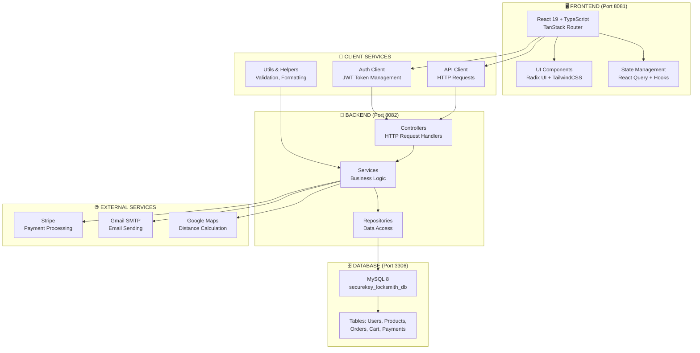

## Frontend Component Hierarchy

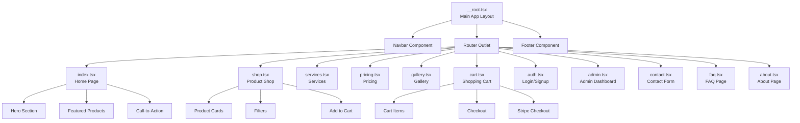

## Backend Layers

```mermaid
graph LR
    subgraph HTTP["HTTP Layer"]
        Request["HTTP Request"]
    end
    
    subgraph Ctrl["Controller Layer"]
        AuthCtrl["AuthController"]
        CartCtrl["CartController"]
        OrderCtrl["OrderController"]
        PaymentCtrl["PaymentController"]
        ProductCtrl["ProductController"]
        AdminCtrl["AdminController"]
    end
    
    subgraph Svc["Service Layer"]
        AuthSvc["AuthService"]
        CartSvc["CartService"]
        OrderSvc["OrderService"]
        PaymentSvc["PaymentService"]
        DistSvc["DistanceCalculationService"]
        NotifSvc["NotificationService"]
    end
    
    subgraph Repo["Repository Layer"]
        UserRepo["UserRepository"]
        CartRepo["CartItemRepository"]
        OrderRepo["OrderRepository"]
        ProductRepo["ProductRepository"]
    end
    
    subgraph DB["Database Layer"]
        UserTable["users"]
        CartTable["cart_items"]
        OrderTable["orders"]
        ProductTable["products"]
    end
    
    Request --> Ctrl
    Ctrl --> Svc
    Svc --> Repo
    Repo --> DB
    Svc -.->|External| Stripe["Stripe API"]
    Svc -.->|External| Gmail["Gmail SMTP"]
    Svc -.->|External| Maps["Google Maps"]
```

## Authentication Flow

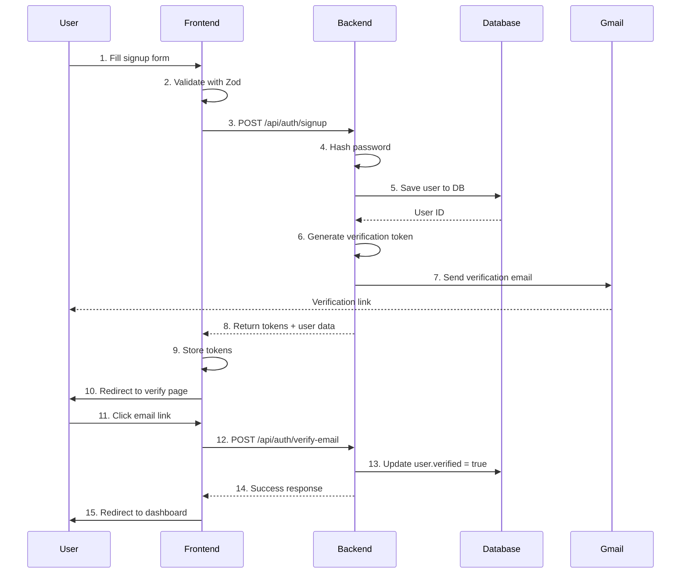

## Order Processing Flow

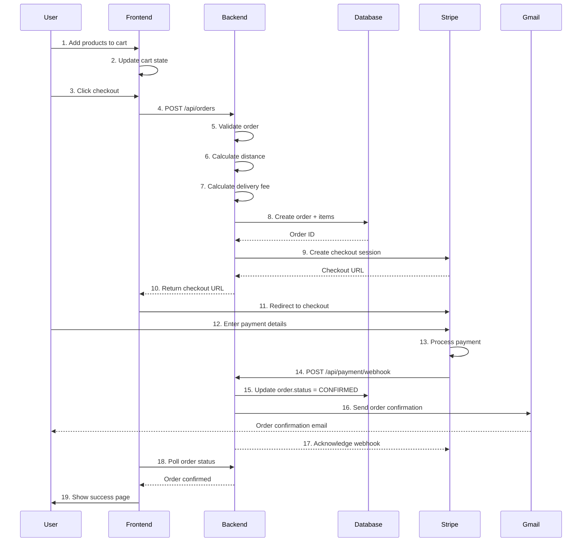

## Database Schema Relationships

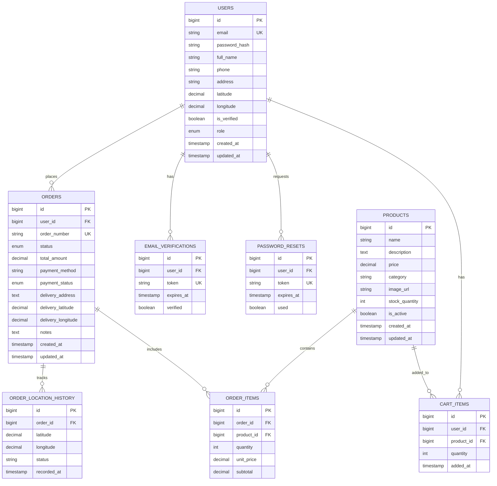

## Request/Response Cycle

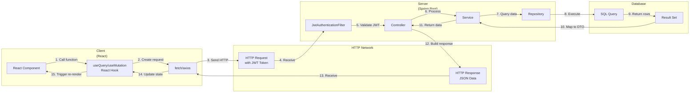

## State Management

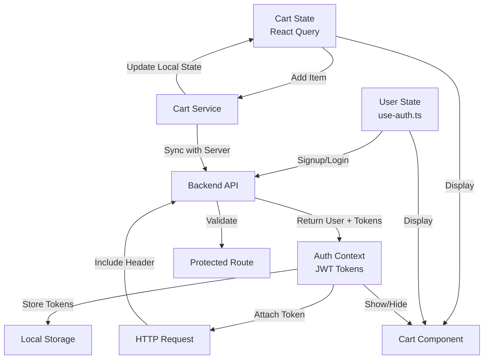

## Error Handling Flow

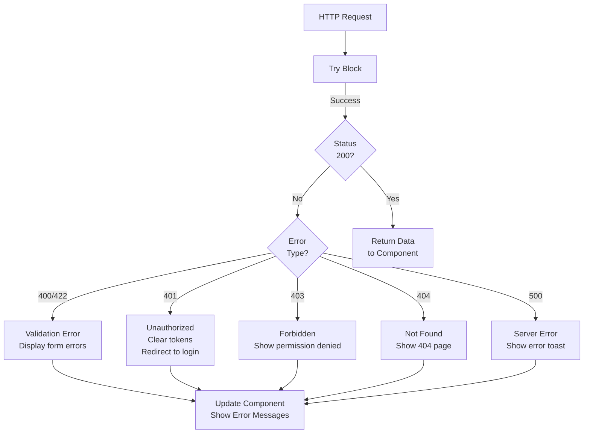

## Deployment Architecture (Recommended)

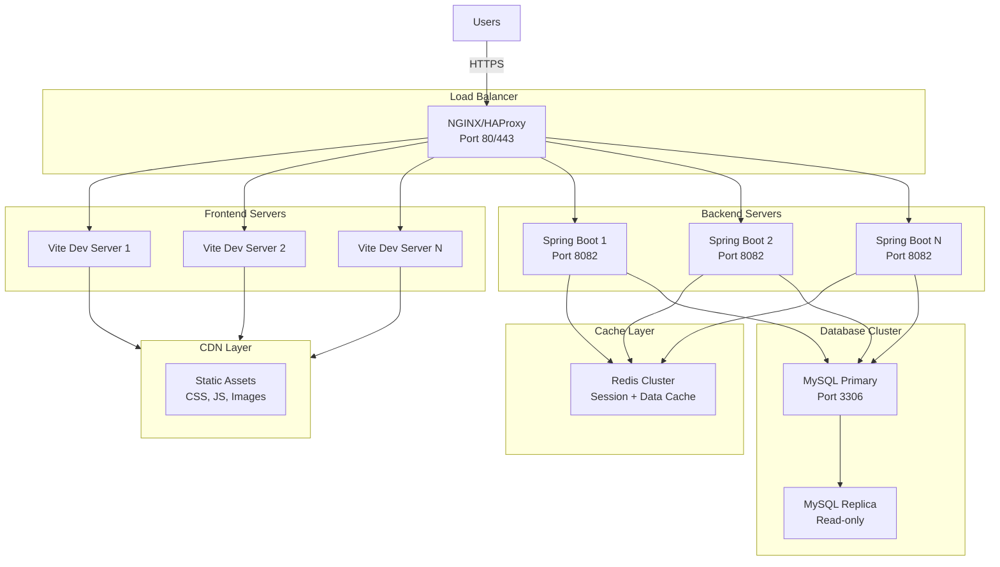

## Technology Stack Versions

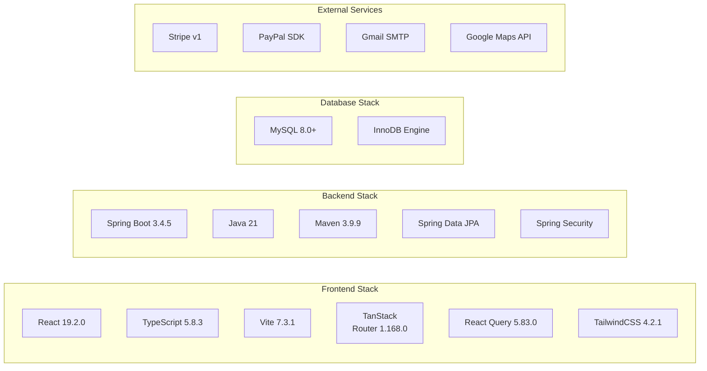

---

**Last Updated:** May 7, 2026  
**Diagram Format:** Mermaid  
**Complexity Level:** Enterprise
